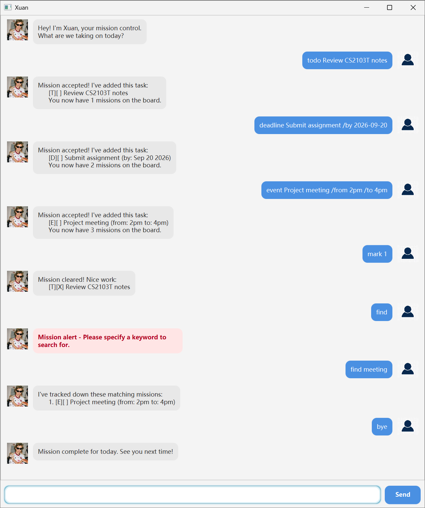

# Xuan User Guide

Xuan is a task management chatbot that helps users manage todos, deadlines, and events through simple text commands.

Xuan acts as a friendly mission-control task buddy. You can add tasks, mark tasks as completed, search for tasks, and view deadlines on a specific date.

## Viewing help

Use the `help` command to view the list of available commands.

Example:

`help`

Xuan will display the supported commands and their usage.

## Viewing all tasks

Use the `list` command to view all tasks currently stored in Xuan.

Example:

`list`

Expected outcome:

Xuan displays all tasks on your mission board together with their task numbers and completion status.

## Adding todos

Use the `todo` command to add a task without a specific date or time.

Format:

`todo <description>`

Example:

`todo read book`

Expected outcome:

Xuan adds the todo to the task list and displays the updated number of tasks.

## Adding deadlines

Use the `deadline` command to add a task that must be completed by a specific date.

Format:

`deadline <description> /by yyyy-MM-dd`

Example:

`deadline submit assignment /by 2026-09-20`

Expected outcome:

Xuan adds the deadline and displays its due date.

The date must follow the `yyyy-MM-dd` format.

## Adding events

Use the `event` command to add an event with a start time and an end time.

Format:

`event <description> /from <start time> /to <end time>`

Example:

`event project meeting /from 2pm /to 4pm`

Expected outcome:

Xuan adds the event together with its start and end times.

## Marking a task as done

Use the `mark` command to mark an existing task as completed.

Format:

`mark <task number>`

Example:

`mark 2`

Expected outcome:

Xuan marks the selected task as completed.

## Marking a task as not done

Use the `unmark` command to change a completed task back to not completed.

Format:

`unmark <task number>`

Example:

`unmark 2`

Expected outcome:

Xuan marks the selected task as not completed.

## Deleting a task

Use the `delete` command to remove a task from the task list.

Format:

`delete <task number>`

Example:

`delete 2`

Expected outcome:

Xuan removes the selected task and displays the updated number of tasks.

## Finding tasks

Use the `find` command to search for tasks whose descriptions contain a keyword.

Format:

`find <keyword>`

Example:

`find book`

Expected outcome:

Xuan displays all tasks whose descriptions contain the specified keyword.

## Finding deadlines by date

Use the `finddate` command to find deadlines that occur on a specific date.

Format:

`finddate yyyy-MM-dd`

Example:

`finddate 2026-09-20`

Expected outcome:

Xuan displays all deadlines that occur on the specified date.

If no deadlines are found, Xuan informs the user that the date is clear.

## Error handling

Xuan detects common invalid inputs and displays an error message instead of terminating unexpectedly.

Examples include:

- entering an unknown command
- omitting required information
- entering an invalid task number
- entering an invalid date
- specifying `/by`, `/from`, or `/to` more than once
- providing additional arguments to commands such as `list` or `bye`

Error messages are highlighted in the GUI to make them easier to notice.

## Exiting Xuan

Use the `bye` command to exit Xuan.

Example:

`bye`

Expected outcome:

Xuan displays a goodbye message and closes the application.